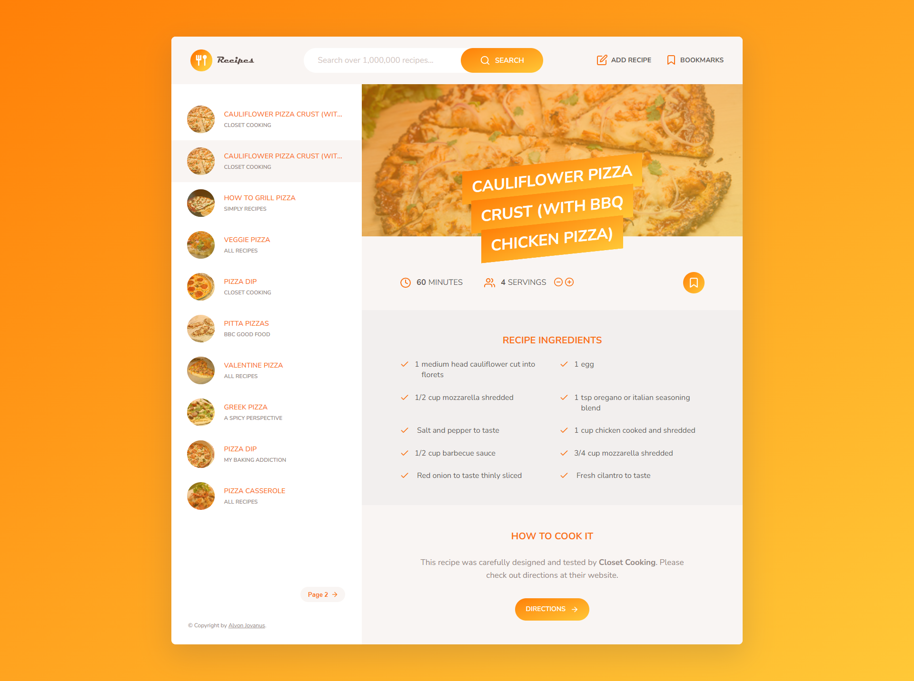

# Recipes Project

A website application for searching food recipes that can be customized according to the number of people.
Built using MVC architecture.

## Tech Stack

- HTML
- CSS
- JavaScript
- SASS
- Parcel

## Link website

https://recipes-alvon.netlify.app/

| Screenshot                                      |
| ----------------------------------------------- |
|  |

## Available search queries:

- broccolia
- carrot
- asparagus
- cauliflower
- corn
- cucumber
- green pepper
- lettuce
- mushrooms
- onion
- potato
- pumpkin
- red pepper
- tomato
- beetroot
- brussel sprouts
- peas
- zucchini
- radish
- sweet potato
- artichoke
- leek
- cabbage
- celery
- chili
- garlic
- basil
- coriander
- parsley
- dill
- rosemary
- oregano
- cinnamon
- saffron
- green bean
- bean
- chickpea
- lentil
- apple
- apricot
- avocado
- banana
- blackberry
- blackcurrant
- blueberry
- boysenberry
- cherry
- coconut
- fig
- grape
- grapefruit
- kiwifruit
- lemon
- lime
- lychee
- mandarin
- mango
- melon
- nectarine
- orange
- papaya
- passion fruit
- peach
- pear
- pineapple
- plum
- pomegranate
- quince
- raspberry
- strawberry
- watermelon
- salad
- pizza
- pasta
- popcorn
- lobster
- steak
- bbq
- pudding
- hamburger
- pie
- cake
- sausage
- tacos
- kebab
- poutine
- seafood
- chips
- fries
- masala
- paella
- som tam
- chicken
- toast
- marzipan
- tofu
- ketchup
- hummus
- chili
- maple syrup
- parma ham
- fajitas
- champ
- lasagna
- poke
- chocolate
- croissant
- arepas
- bunny chow
- pierogi
- donuts
- rendang
- sushi
- ice cream
- duck
- curry
- beef
- goat
- lamb
- turkey
- pork
- fish
- crab
- bacon
- ham
- pepperoni
- salami
- ribs

## Installation

Clone and move to the repository

```bash
git clone https://github.com/AlvonJ/recipes-alvon
cd recipes-alvon
```

Install depedencies and run the server

```bash
npm i
npm run build
npm start
```
